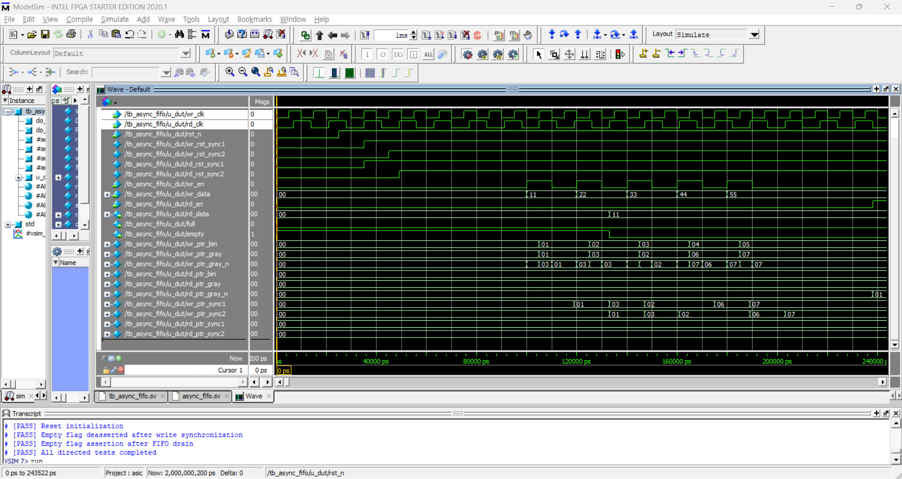

# async-fifo-cdc
SystemVerilog asynchronous FIFO with Gray-code pointers, dual-clock CDC synchronization, and self-checking verification.

<br>

## Overview

This repository contains an asynchronous FIFO RTL implementation written in SystemVerilog.
The module is designed to transfer data between two independent clock domains:
- Write clock domain: `wr_clk`
- Read clock domain: `rd_clk`

Because the write and read clocks can run at different frequencies and phases, pointer information must cross the clock-domain boundary safely.
This implementation uses binary pointers for FIFO memory addressing, converts the pointers to Gray code for clock-domain crossing, and synchronizes each Gray-code pointer with a two-flop synchronizer in the destination clock domain.

<br>

## Block Diagram


<br>

## Features

| Item | Spec |
|---|---|
| RTL language | SystemVerilog |
| Module name | `async_fifo` |
| FIFO type | Asynchronous FIFO |
| Default data width | Parameterized data width |
| Default FIFO depth | Parameterized FIFO depth |
| Memory addressing | Binary pointers |
| CDC pointer transfer | Gray-code pointers |
| CDC synchronizer | Two flip-flop synchronizer |
| Write protection | Write operation is blocked when `full = 1` |
| Read protection | Read operation is blocked when `empty = 1` |
| Reset input | Active-low reset, `rst_n` |
| Read-data style | Show-ahead / FWFT combinational read path |

<br>

### Module Parameters

| Parameter | Default | Description |
|---|---:|---|
| `WIDTH` | 8 | FIFO data width in bits |
| `DEPTH` | 16 | FIFO depth. Must be a power of two |

#### Design Constraints

- `DEPTH` must be a power of two.
- The default configuration is `WIDTH = 8` and `DEPTH = 16`.

<br>

### Interface

| Signal | Direction | Clock Domain | Description |
|---|---|---|---|
| `rst_n`    | Input  | Both | Active-low reset |
| `wr_clk`   | Input  | Write | Write clock |
| `wr_en`    | Input  | Write | Write enable |
| `wr_data`  | Input  | Write | Write data |
| `full`     | Output | Write | FIFO full status |
| `rd_clk`   | Input  | Read | Read clock |
| `rd_en`    | Input  | Read | Read enable |
| `rd_data`  | Output | Read | Read data |
| `empty`    | Output | Read | FIFO empty status |

#### Read Interface

This FIFO uses a show-ahead / FWFT read interface.
- `rd_data` is valid when `empty = 0` and invalid when `empty = 1`.
- `rd_en` consumes the current entry and advances the read pointer on the next `rd_clk` edge.

<br>

## Directory Structure

```text
.
├── LICENSE
├── README.md
├── rtl/
│   └── async_fifo.sv
├── tb/
│   └── tb_async_fifo.sv
└── docs/
    ├── Async_FIFO block diagram.png
    ├── verification_results.md
    └── waveform/
        ├── full_empty_boundary.png
        └── cdc_sync.png
```

<br>

## How to Simulate

Example simulation flow using Questa/ModelSim:

```bash
vlib work
vlog rtl/async_fifo.sv
vlog tb/tb_async_fifo.sv
vsim -c tb_async_fifo -do "run -all; quit"
```

<br>

## Verification

The design is verified with a directed, self-checking testbench using a queue-based scoreboard. Test scenarios cover full/empty boundary conditions, simultaneous read/write, non-aligned clock phases, and reset assertion during transactions.



See [verification_results.md](docs/verification_results.md) for full test cases and results.

<br>

## Synthesis Results

The design was synthesized successfully using Intel Quartus Prime Pro Edition.
| Item | Result |
|---|---|
| Tool | Intel Quartus Prime Pro Edition 18.0.0 Build 219 |
| Target family | Cyclone 10 GX |
| Target device | 10CX220YF780I5G |
| Top-level entity | async_fifo |
| Compilation status | Successful |
| Logic utilization | 29 / 80,330 ALMs (< 1%) |
| Register utilization | 53 registers |
| Block memory utilization | 128 / 12,021,760 bits (< 1%) |
| `wr_clk` Fmax | [Actual Restricted Fmax] MHz |
| `rd_clk` Fmax | [Actual Restricted Fmax] MHz |
| Setup timing (`wr_clk`) | Passed, worst-case slack: 7.855 ns |
| Setup timing (`rd_clk`) | Passed, worst-case slack: 12.241 ns |
| Hold timing (`wr_clk`) | Passed, worst-case slack: 0.071 ns |
| Hold timing (`rd_clk`) | Passed, worst-case slack: 0.057 ns |

The wr_clk and rd_clk domains are constrained as asynchronous clock groups in the SDC file.

<br>

## Design Decisions

### Binary and Gray-code pointers

The FIFO maintains both binary and Gray-code pointers in each clock domain.

- Binary pointers are used for indexing the FIFO memory.
- Gray-code pointers are used when pointer values cross between clock domains.
- A Gray-code pointer changes only one bit between adjacent count values, reducing the risk of sampling multiple changing bits during asynchronous transfer.

### Two-flop synchronizers

Each Gray-code pointer is transferred into the opposite clock domain through a two-stage flip-flop synchronizer.

- The write clock domain synchronizes the read Gray-code pointer.
- The read clock domain synchronizes the write Gray-code pointer.
- The synchronizers reduce the probability that metastability propagates into local control logic.

### Pointer width

The pointers use one additional bit beyond the memory address width.

```text
Address width = $clog2(DEPTH)
Pointer width = $clog2(DEPTH) + 1
```

The additional most-significant pointer bit distinguishes pointer wrap-around and is used in full-condition detection.

### Status flags

- `empty` is generated in the read clock domain by comparing the read pointer and synchronized write pointer.
- `full` is generated in the write clock domain by comparing the write pointer and synchronized read pointer.
- Write operations occur only when `wr_en && !full`.
- Read pointer updates occur only when `rd_en && !empty`.

### Reset strategy

The design uses a common active-low reset input, `rst_n`.

Reset assertion is asynchronous through sensitivity to the active-low reset. Reset release is locally synchronized in the write and read clock domains through `wr_rst_sync1/wr_rst_sync2` and `rd_rst_sync1/rd_rst_sync2`.

## Limitations & Future Work

### Current Limitations

- A simulation testbench is not yet included.
- No automated queue-based data scoreboard is included yet.
- No simulation waveform or coverage result is currently included.
- No SystemVerilog Assertions are currently included.
- No formal verification has been performed.
- No CDC lint analysis result is included.
- No FPGA synthesis or timing-closure result is included.
- The current code should be reviewed and verified carefully at full/empty boundary conditions.
- The `DEPTH` parameter is intended for power-of-two values.
- The combinational read-data path may not infer FPGA block RAM on all devices and tools.
- As with any asynchronous FIFO, correct behavior depends on appropriate timing constraints and CDC-aware implementation practices.

### Future Work

1. Add a directed SystemVerilog testbench.
2. Add independent write and read clock generation.
3. Add a queue-based scoreboard for automatic FIFO ordering checks.
4. Add full and empty boundary-condition tests.
5. Add simultaneous read/write tests.
6. Add randomized stimulus.
7. Add SystemVerilog Assertions for overflow, underflow, and pointer/flag behavior.
8. Add functional coverage and code coverage results.
9. Add simulation waveform images.
10. Perform FPGA synthesis using Quartus or Vivado.
11. Record area, timing, and memory-inference results.
12. Add FPGA-specific CDC attributes such as `ASYNC_REG` where supported.
13. Perform static CDC and reset-domain-crossing review.
14. Consider a synchronous-read memory version for block-RAM-oriented FPGA implementation.
