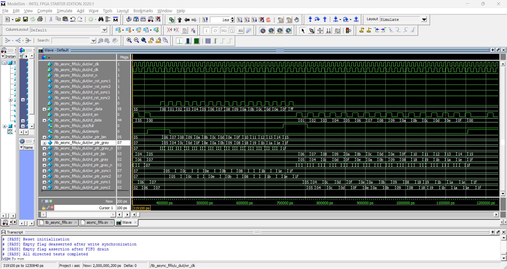

## Verification Results

The asynchronous FIFO was verified using a self-checking SystemVerilog testbench with independent write and read clock domains. A queue-based scoreboard was used to compare accepted write data against read data and verify first-in, first-out ordering.

<br>

### Simulation Configuration

| Item | Configuration |
|---|---|
| Testbench | Self-checking SystemVerilog testbench |
| FIFO data width | 8 bits |
| FIFO depth | 16 entries |
| Write clock period | 10 ns |
| Write clock frequency | 100 MHz |
| Read clock period | 14 ns |
| Read clock frequency | Approximately 71.4 MHz |
| Clock relationship | Independent clocks with different periods |
| Reset | Common active-low reset, `rst_n` |
| Data checking | Queue-based scoreboard |

<br>

### Directed Test Results

| Test Case | Result |
|---|---|
| Reset initialization | PASS |
| Initial `empty = 1` and `full = 0` state | PASS |
| Basic write operation | PASS |
| Basic read operation | PASS |
| FIFO data ordering | PASS |
| Queue-based scoreboard comparison | PASS |
| Empty flag deassertion after write synchronization | PASS |
| Empty flag assertion after FIFO drain | PASS |
| Full flag assertion after `DEPTH` accepted writes | PASS |
| Write blocked while `full = 1` | PASS |
| Read blocked while `empty = 1` | PASS |
| Write pointer remains unchanged during blocked full-state write | PASS |
| Read pointer remains unchanged during blocked empty-state read | PASS |

<br>

### Verification Method

The testbench performs the following checks:

- Applies active-low reset and verifies the initial FIFO status:
  - `empty = 1`
  - `full = 0`
- Writes five known data values:

```text
0x11, 0x22, 0x33, 0x44, 0x55
```

- Waits for the write Gray-code pointer to propagate through the read-domain synchronizer.
- Reads the stored data and compares each value against the queue-based scoreboard.
- Verifies that data is returned in first-in, first-out order.
- Fills the FIFO with `DEPTH` entries and verifies that `full` asserts.
- Issues an additional write request while `full = 1` and verifies that the write pointer does not advance.
- Drains the FIFO and verifies that `empty` asserts.
- Issues an additional read request while `empty = 1` and verifies that the read pointer does not advance.
- Uses independent 100 MHz write and approximately 71.4 MHz read clocks to exercise asynchronous pointer synchronization.

<br>

### Waveform Captures

**Full/empty boundary condition**

Write pointer fills the FIFO to `DEPTH`, `full` asserts, a blocked write is issued, the FIFO is drained, and `empty` re-asserts.



**CDC synchronization**

The write Gray-code pointer propagates through the two-flop synchronizer into the read clock domain before `empty` deasserts.


